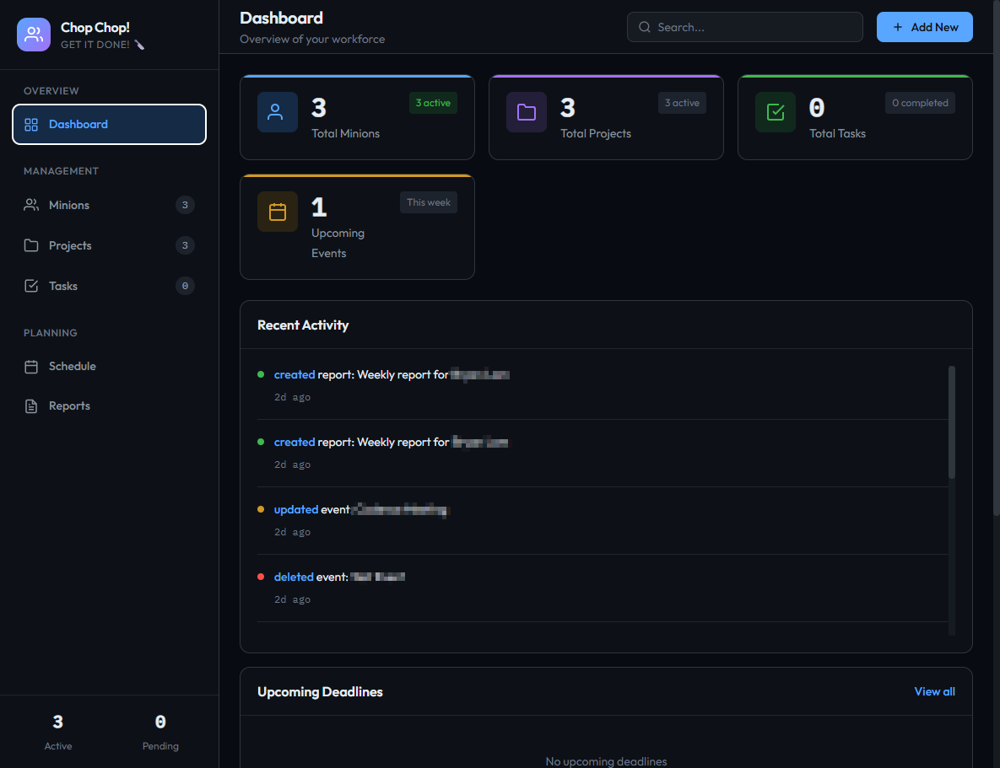
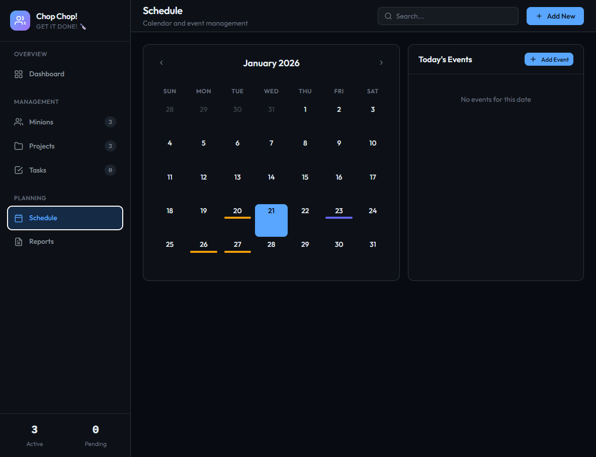

# Chop Chop! 🔪

*Get moving! No slacking allowed.*

A web application to track intern progress, schedules, and projects (NOT LIMITED TO INTERNS).

## Features

- Track interns information and progress
- Manage projects with task-based completion tracking
- Kanban-style task management with drag-and-drop
- Schedule and calendar management
- Google Drive backup and sync
- File upload support

## Screenshots

### Dashboard


### Minions Management


### Schedule & Calendar


## Prerequisites

- Node.js (v14 or higher)
- npm

## Installation

1. Clone the repository:
   ```bash
   git clone https://github.com/sh-how/chop-chop.git
   cd chop-chop
   ```

2. Install dependencies:
   ```bash
   npm install
   ```

3. Set up environment variables:
   ```bash
   cp .env.example .env
   # Edit .env with your Google OAuth credentials (optional, for sync feature)
   ```

4. Start the server:
   ```bash
   npm start
   ```
   For development with hot reload:
   ```bash
   npm run dev
   ```

5. Open your browser and navigate to `http://localhost:3000`

## Project Structure

```
├── data/               # SQLite database and tokens
├── public/             # Frontend files
│   ├── css/           # Stylesheets
│   ├── js/            # JavaScript files
│   └── index.html     # Main HTML file
├── server/            # Backend server
│   ├── index.js       # Express server
│   ├── sync.js        # Google Drive sync
│   └── dev.js         # Development server with hot reload
├── uploads/           # Uploaded files
└── package.json       # Project configuration
```

## Tech Stack

- **Backend**: Node.js, Express
- **Database**: SQLite (better-sqlite3)
- **Frontend**: HTML, CSS, JavaScript

## License

MIT


